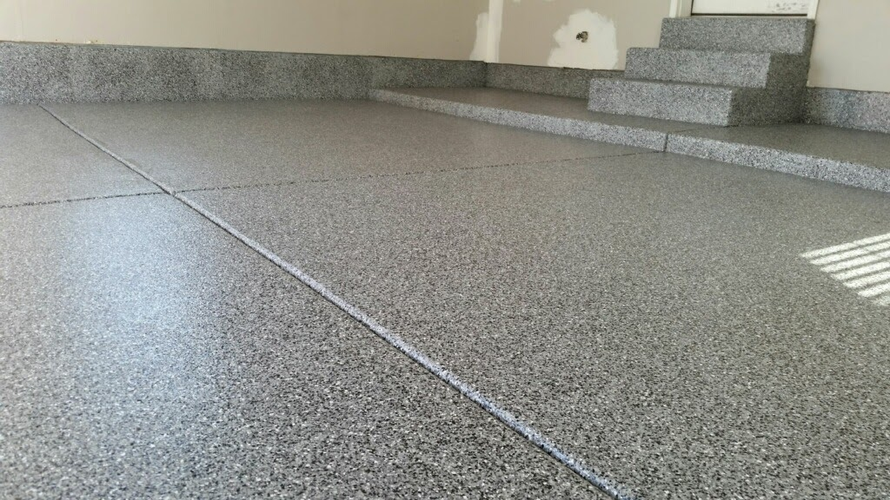
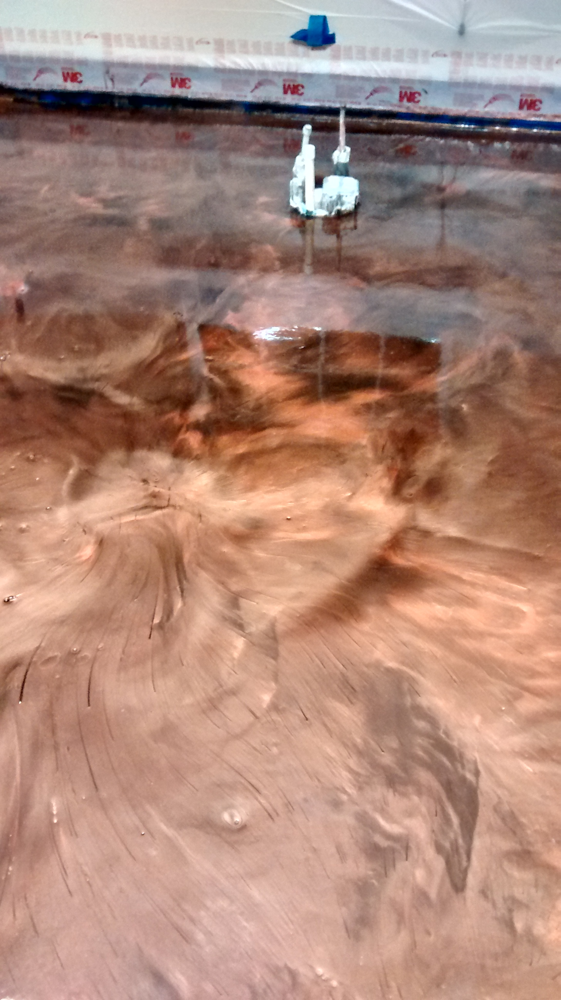
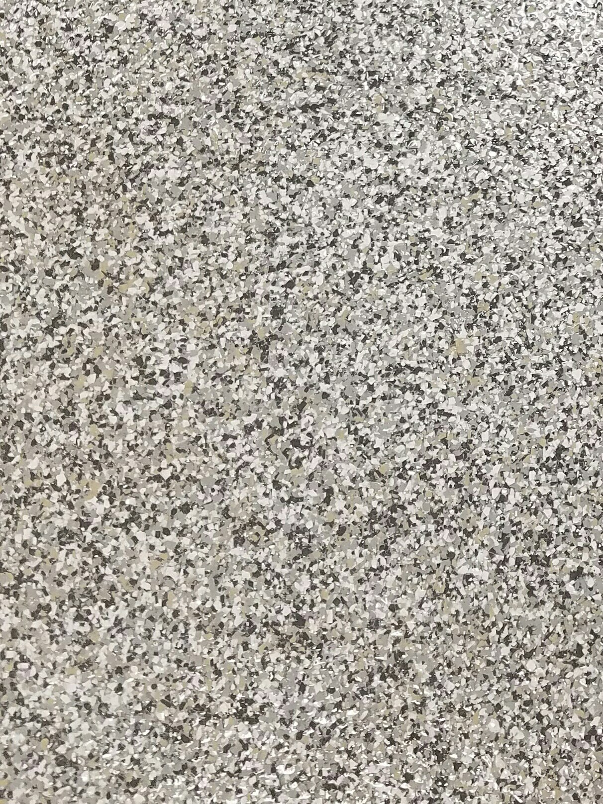
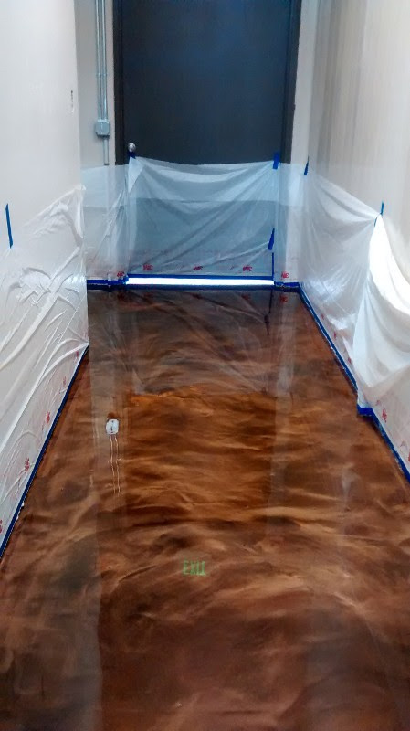

### Does your concrete need to be recovered? If so, I can help you find the perfect solution! Some of our options include:

  

    
    

      <h5 class="card-title">Style that Lasts</h5>
      
Redoing your outdoor patio? Look at what a custom design will do for it.

      
Staining your deck giving it a new look and feel!

    

  

  

    
    

      <h5 class="card-title">Great Protection</h5>
      
Use garage floor epoxy to protect your floors from slipping and stains.

      
Overlaying your driveway to get rid of pesky cracks and chipping.

      
Let us help give your concrete a new look that lasts.

    

  

  

    
    

      <h5 class="card-title">Find the Right Touch</h5>
      
Use a metallic epoxy to finish your basement floors.

      
It looks great, lasts and is easy to maintain.

    

  

